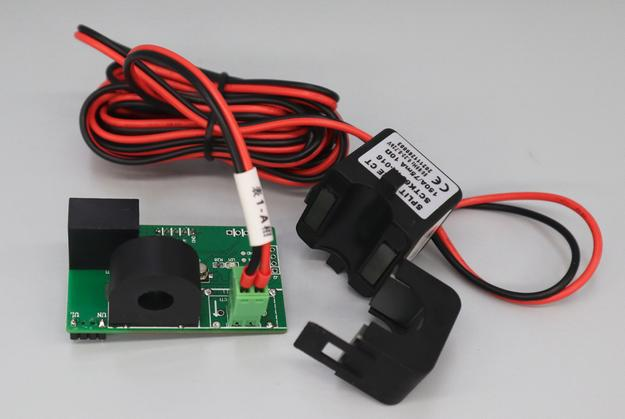

# JSY-MK-194

Sample usage of module JSY-MK-194 with an Arduino Uno.

- [bitrate](bitrate/) : change the bitrate speed of serialport
- [wattmeter](wattmeter/) : display power in watt on i2c LCD 2 x 16.

Note : Due to limitation of Uno at only once serial port, before upload firmware on Uno, you must unplug the serial port of JSY-MK-194.

